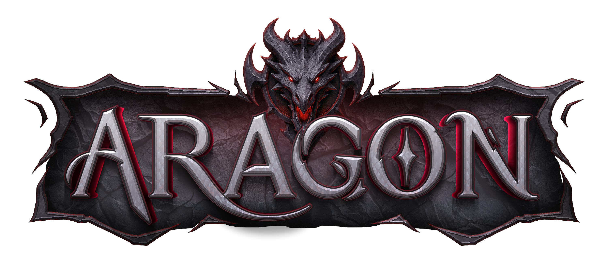

# Aragon RSPS Launcher

A professional, auto-updating desktop launcher for Aragon RuneScape Private Server (RSPS), built with JavaFX.



## Features

✨ **Auto-Update System**
- Checks for client updates from remote manifest
- SHA-256 hash verification for file integrity
- Differential updates (only downloads what changed)
- Progress tracking with download speed and ETA

🎮 **Professional UI**
- Custom red & black theme matching Aragon branding
- Smooth animations and modern design
- Undecorated window with custom controls
- System tray integration

⚙️ **Configurable**
- Custom JVM arguments (memory allocation, etc.)
- Minimize to tray option
- Auto-update toggle
- Persistent settings

📦 **Native Installers**
- Windows .exe installer with Start Menu shortcuts
- macOS .dmg with drag-to-Applications
- Linux .deb package
- Embedded JRE (no Java installation required for users)

## Quick Start

### For Users (Installing the Launcher)

1. Download the installer for your platform from the releases page
2. Run the installer and follow the setup wizard
3. Launch Aragon Launcher from your desktop or Start Menu
4. The launcher will automatically download and update the game client
5. Click **PLAY** to start the game

### For Developers (Building the Launcher)

See **[BUILD.md](BUILD.md)** for complete build instructions.

**Quick build:**
```bash
# Windows
build-scripts\build-windows.bat

# macOS/Linux
./build-scripts/build-macos.sh
./build-scripts/build-linux.sh
```

## Requirements

### For Users:
- No requirements! The launcher includes everything needed.

### For Developers:
- JDK 17 or higher
- Maven 3.6+
- Platform-specific tools (see BUILD.md)

## Project Structure

```
aragon-launcher/
├── src/main/java/com/aragon/launcher/
│   ├── Main.java                      # Application entry point
│   ├── model/
│   │   └── Manifest.java              # Manifest data model
│   ├── service/
│   │   ├── UpdateService.java         # Update checking and downloading
│   │   └── ClientLauncher.java        # Client process management
│   ├── ui/
│   │   └── LauncherController.java    # JavaFX UI controller
│   └── util/
│       ├── Config.java                # Configuration management
│       └── HashUtil.java              # File hashing utilities
├── src/main/resources/
│   ├── css/
│   │   └── launcher.css               # Custom styling
│   └── images/
│       ├── logo.png                   # Aragon logo
│       └── icon.png                   # Application icon
├── build-scripts/
│   ├── build-windows.bat              # Windows build script
│   ├── build-macos.sh                 # macOS build script
│   └── build-linux.sh                 # Linux build script
├── pom.xml                            # Maven configuration
└── BUILD.md                           # Detailed build instructions
```

## How It Works

1. **Launcher starts** → Loads local configuration and manifest
2. **Update check** → Fetches remote `manifest.json` from your CDN
3. **Version comparison** → Compares remote vs local version numbers
4. **Download** → If update available, downloads new `client.jar`
5. **Hash verification** → Validates SHA-256 hash for security
6. **Launch** → Starts the game client with configured JVM arguments

## Manifest Format

The launcher expects a `manifest.json` file hosted on your web server:

```json
{
  "latest": {
    "standalone": "1.0.0",
    "windows": "1.0.0"
  },
  "files": [
    {
      "os": "standalone",
      "version": "1.0.0",
      "url": "https://cdn.aragonrsps.com/client.jar",
      "size": 4094821,
      "hash": "sha256-hash-here",
      "changelog": "Bug fixes and improvements"
    }
  ]
}
```

## Configuration

User settings are stored in:
- **Windows**: `%AppData%\AragonLauncher\config.json`
- **macOS**: `~/Library/Application Support/AragonLauncher/config.json`
- **Linux**: `~/.config/AragonLauncher/config.json`

```json
{
  "jvmArgs": "-Xmx2G -Xms512M",
  "minimizeToTray": true,
  "autoUpdate": true,
  "lastVersion": "1.0.0"
}
```

## Customization

### Change Theme
Edit `src/main/resources/css/launcher.css` to modify colors and styling.

### Change Manifest URL
Edit `src/main/java/com/aragon/launcher/util/Config.java`:
```java
public static final String MANIFEST_URL = "https://your-cdn.com/manifest.json";
```

### Change Default JVM Args
Edit `Config.java`:
```java
private String jvmArgs = "-Xmx4G -Xms1G";  // Example: 4GB max, 1GB min
```

## Technologies Used

- **JavaFX 17** - Modern UI framework
- **Maven** - Dependency management and build
- **jpackage** - Native installer creation
- **jlink** - Custom JRE bundling
- **Gson** - JSON parsing
- **SLF4J** - Logging

## License

This project is provided as-is for use with Aragon RSPS. Modify and distribute as needed for your server.

## Support

For issues or questions:
- Check [BUILD.md](BUILD.md) for build troubleshooting
- Review logs in the launcher's data directory
- Ensure your manifest.json is properly formatted and accessible

## Credits

Built for **Aragon RSPS** - A premium RuneScape private server experience.

---

**Note:** This is a desktop application meant to be built locally. It requires JDK 17+ with JavaFX for development.
